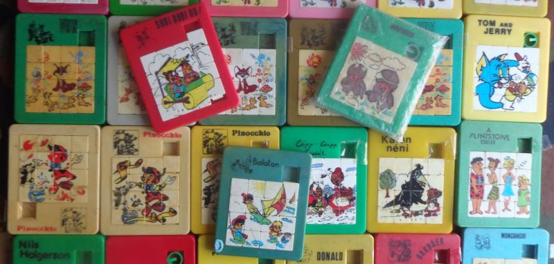
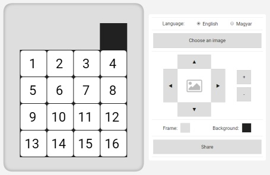
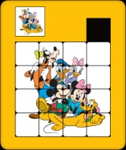
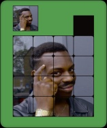

# Sliding-Puzzle-Factory

*Source: http://www.retrojatekmuzeum.hu/2015/03/butor-mihaly-fele-tili-toli-kirakok.html*

# Description

This is a digital implemenation of a 15 puzzle variant that was popular in Hungary during the 80s and 90s. The app lets you create your own custom version of the puzzle: https://balazsdavid987.github.io/Sliding-Puzzle-Factory/

Choose an image, a color for the frame and another for the background, and you will get an URL on which your puzzle is available.

#  Video demonstration

https://www.youtube.com/watch?v=q7US-sD0xgU

# Examples

| Screenshot | Link |
|------------|------|
|  | https://balazsdavid987.github.io/Sliding-Puzzle-Factory/#c=0&clr1=539daf&clr2=0C0707&x=3&y=4&s=94&u=https://i.imgur.com/0otMFr4.png |
|  | https://balazsdavid987.github.io/Sliding-Puzzle-Factory/#c=0&clr1=FFC107&clr2=20211B&x=-4&y=-4&s=104&u=https://i.imgur.com/TgTW4aK.jpg |
|  | https://balazsdavid987.github.io/Sliding-Puzzle-Factory/#c=0&clr1=549c4e&clr2=31325b&u=https://i.imgur.com/zWTBxHV.jpg |

# Articles on the original 15 puzzle
* 15 puzzle - Wikipedia https://en.wikipedia.org/wiki/15_puzzle
* 15 Puzzle -- from Wolfram MathWorld http://mathworld.wolfram.com/15Puzzle.html
* 15-Puzzle Optimal Solver http://kociemba.org/fifteen/fifteensolver.html
